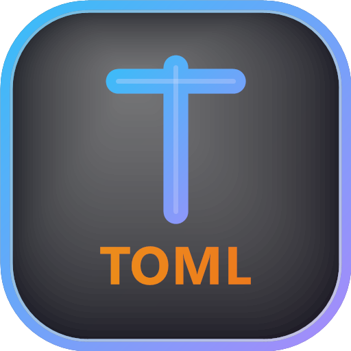

# Tomlyn [](https://github.com/xoofx/Tomlyn/actions/workflows/ci.yml)  [](https://coveralls.io/github/xoofx/Tomlyn?branch=main)  [](https://www.nuget.org/packages/Tomlyn/)



Tomlyn is a high-performance [TOML](https://toml.io/en/) 1.1 parser and a `System.Text.Json`-style serializer for .NET.

## What is TOML?

> **_A config file format for humans._**
> _TOML aims to be a minimal configuration file format that's easy to read due to obvious semantics. TOML is designed to map unambiguously to a hash table. TOML should be easy to parse into data structures in a wide variety of languages._

- See the official website https://toml.io/en/ for more details.
- TOML specs: [TOML v1.1.0](https://toml.io/en/v1.1.0)

## Features

- TOML 1.1.0 support (Tomlyn 1.0 does **not** support TOML 1.0).
- Allocation-free pull-based parsing: `TomlLexer` → `TomlParser` (precise spans for all parse errors).
- Lossless syntax tree: `SyntaxParser.Parse(...)` → `DocumentSyntax` (roundtrippable, trivia-preserving).
- High-level serializer shaped like `System.Text.Json`: `TomlSerializer`, `TomlSerializerOptions`, `TomlSerializerContext`, `TomlTypeInfo<T>`.
- Source generation for NativeAOT/trimming (no runtime reflection required).
- Reflection-based POCO mapping remains available (can be disabled for NativeAOT via feature switch / publish settings).

## Documentation

- User guide: `doc/readme.md`
- Website (Lunet): `site/` (published to https://xoofx.github.io/Tomlyn)

## Install

Tomlyn is delivered as a [NuGet Package](https://www.nuget.org/packages/Tomlyn/).

## Usage

### Untyped model (`TomlTable`)

```csharp
using Tomlyn;
using Tomlyn.Model;

var toml = @"global = ""this is a string""
# This is a comment of a table
[my_table]
key = 1 # Comment a key
value = true
list = [4, 5, 6]
";

var model = TomlSerializer.Deserialize<TomlTable>(toml)!;
var global = (string)model["global"]!;

Console.WriteLine(global);
Console.WriteLine(TomlSerializer.Serialize(model));
```

### Source-generated POCO mapping (`TomlSerializerContext`)

```csharp
using System.Text.Json.Serialization;
using Tomlyn.Serialization;

public sealed class MyConfig
{
    public string? Global { get; set; }
}

#pragma warning disable SYSLIB1224
[TomlSourceGenerationOptions(PropertyNamingPolicy = JsonKnownNamingPolicy.CamelCase)]
[JsonSerializable(typeof(MyConfig))]
internal partial class MyTomlContext : TomlSerializerContext
{
}
#pragma warning restore SYSLIB1224

var config = TomlSerializer.Deserialize(toml, MyTomlContext.Default.MyConfig);
var tomlOut = TomlSerializer.Serialize(config, MyTomlContext.Default.MyConfig);
```

See `doc/readme.md` for details (reflection mapping, attribute support, metadata/trivia, parsing APIs).

## License

This software is released under the [BSD-Clause 2 license](https://opensource.org/licenses/BSD-2-Clause). 

## Author

Alexandre Mutel aka [xoofx](http://xoofx.github.io).
